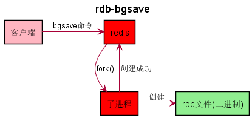
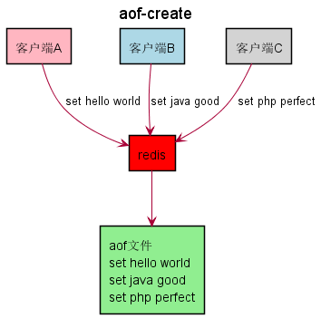
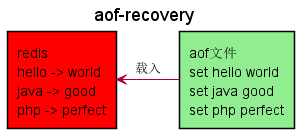
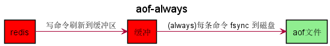

# Redis 持久化

`Redis` 所有数据保持在内存中，对数据的更新将异步地保存到磁盘上。

快照 : `Redis RDB`

写日志 : `Redis AOF`

## RDB

### 快照

如存在老的 `RDB` 文件，新文件会进行替换。

### 触发快照

| 命令 | save | bgsave |
| --- | --- | --- |
| `IO` 类型 | 同步 | 异步 |
| 优点 | 不会消耗额外内存 | 不阻塞客户端命令 |
| 缺点 | 阻塞客户端命令 | 需要 `fork` ，消耗内存 |

## AOF

### 写日志

### 三种策略

| 命令 | always | everysec | no |
| --- | --- | --- | --- |
| 优点 | 不丢失数据 | 每秒一次 `fsync` | 不用管 |
| 缺点 | `IO` 开销大，一般的 `Sata` 盘只有几百 `TPS` | 丢 `1` 秒数据 | 不可控 |

### 重写

| 原生 AOF | AOF 重写 |
| --- | --- |
| set hello world set hello php set hello java incr counter incr counter | set hello java set counter 2 |

- 减少磁盘占用量
- 加速恢复速度

## 对比

| 命令 | RDB | AOF |
| --- | --- | --- |
| 启动优先级 | 低 | 高 |
| 体积 | 小 | 大 |
| 恢复速度 | 快 | 慢 |
| 数据安全性 | 丢数据 | 根据策略决定 |
| 轻重 | 重 | 轻 |