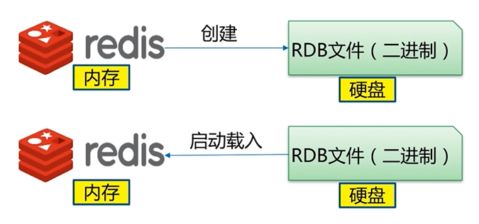
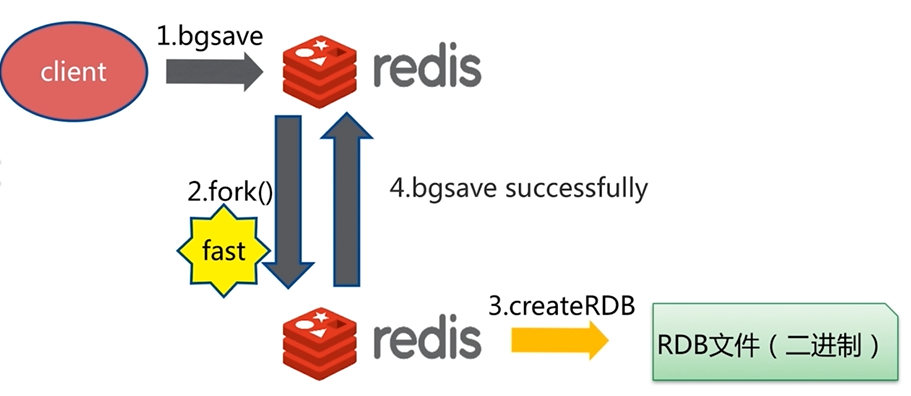
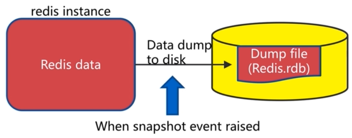
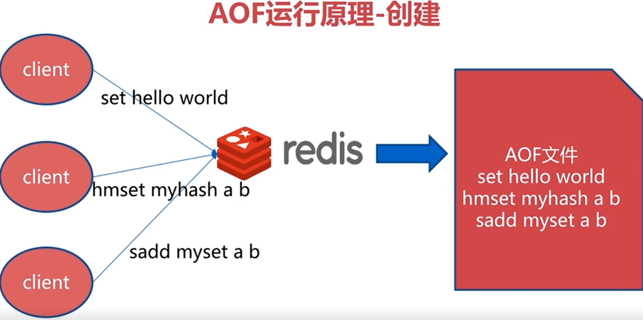
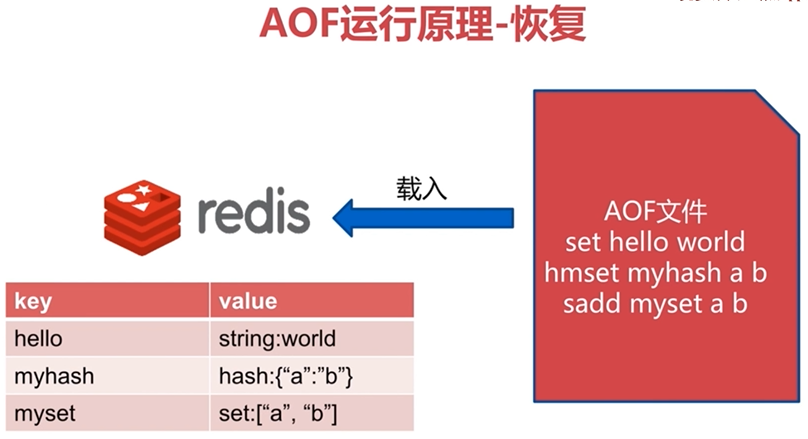
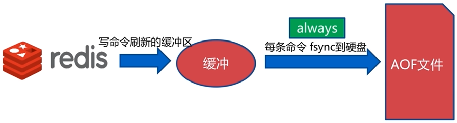
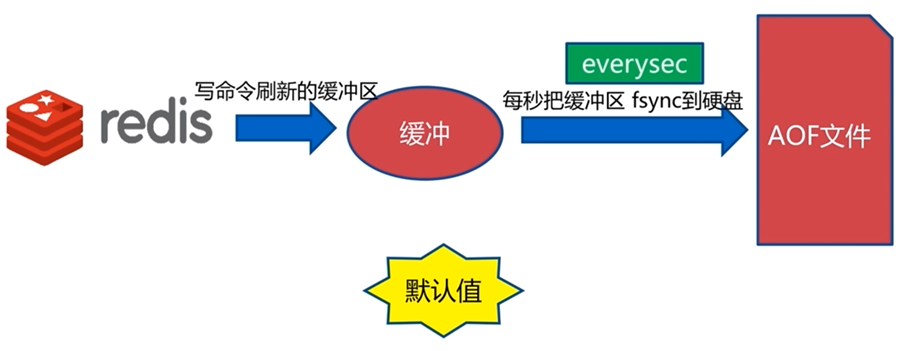
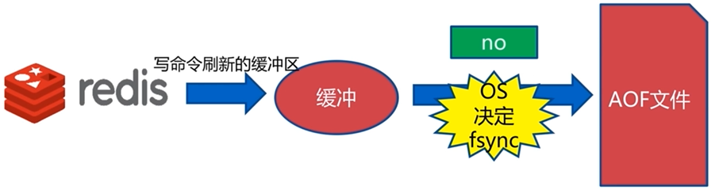
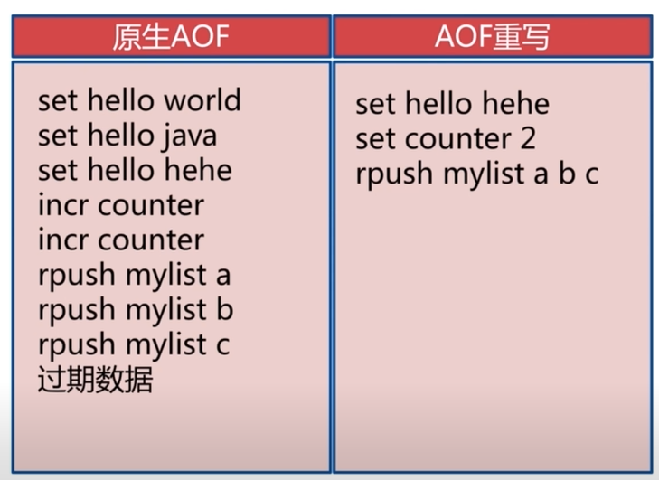
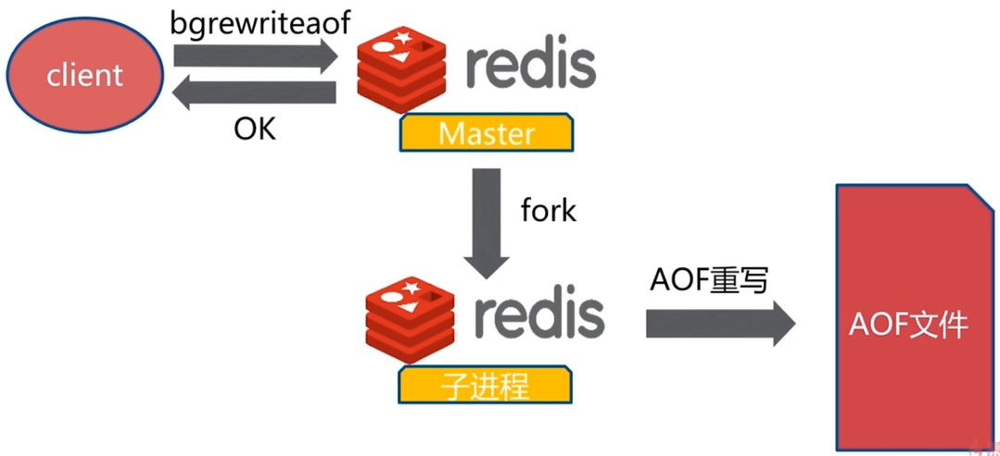

# Redis 持久化的取舍和选择

## 持久化的作用

**什么是持久化**

Redis所有数据保持在内存中，对数据的更新将异步地保存到磁盘上。

**持久化方式**

快照：MySQL Dump、Redis RDB

写日志：MySQL Binlog、Hbase HLog、Redis AOF

## RDB

**什么是RDB**

**触发机制**

- save命令
- 文件策略：如存在老的RDB文件，新文件进行替换
- 复杂度：O(n)

- bgsave命令
- 文件策略和复杂度与save相同

| 命令 | save | bgsave |
| --- | --- | --- |
| IO类型 | 同步 | 异步 |
| 阻塞 | 是 | 是(阻塞发生在fork) |
| 复杂度 | O(n) | O(n) |
| 优点 | 不会消耗额外内存 | 不阻塞客户端命令 |
| 缺点 | 阻塞客户端命令 | 需要fork，消耗内存 |

**其他触发机制**

1. 全量复制
2. debug reload
3. shutdown

**总结**

1. RDB是Redis内存到硬盘的快照，用于持久化。
2. save通常会阻塞Redis。
3. bgsave不会阻塞Redis，但是会fork新进程。
4. save自动配置满足任一就会被执行。
5. 有些触发机制不容忽视。

## AOF

### RDB有什么问题

**耗时、耗性能**

- O(n)数据：耗时
- fork()：消耗内存，copy-on-write策略
- Disk I/O：IO性能

**不可控、丢失数据**

| 时间戳 | save |
| --- | --- |
| T1 | 执行多个写命令 |
| T2 | 满足RDB自动创建的条件 |
| T3 | 再次执行多个写命令 |
| T4 | 宕机 |

### 什么是AOF

### AOF的三种策略

| 命令 | always | everysec | no |
| --- | --- | --- | --- |
| 优点 | 不丢失数据 | 每秒一次fsync | 不用管 |
| 缺点 | IO开销大，一般的Sata盘只有几百TPS | 丢1秒数据 | 不可控 |

### AOF重写

- 减少磁盘占用量
- 加速恢复速度

**bgrewriteaof**

**配置**

| 配置名 | 含义 |
| --- | --- |
| auto-aof-rewrite-min-size | AOF文件重写需要的尺寸 |
| auto-aof-rewrite-percentage | AOF文件增长率 |

**统计**

| 统计名 | 含义 |
| --- | --- |
| aof_current_size | AOF当前尺寸(单位：字节) |
| aof_base_size | AOF上次启动和重写的尺寸(单位：字节) |

## RDB和AOF的抉择

| 命令 | RDB | AOF |
| --- | --- | --- |
| 启动优先级 | 低 | 高 |
| 体积 | 小 | 大 |
| 恢复速度 | 快 | 慢 |
| 数据安全性 | 丢数据 | 根据策略决定 |
| 轻重 | 重 | 轻 |

**RDB最佳策略**

- “关”掉RDB
- 集中管理
- 主从，从开

**AOF最佳策略**

- “开”：缓存和存储
- AOF重写集中管理
- everysec

**最佳策略**

- 小分片
- 缓存或者存储
- 监控(硬盘、内存、负载、网络)
- 足够的内存