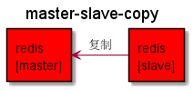
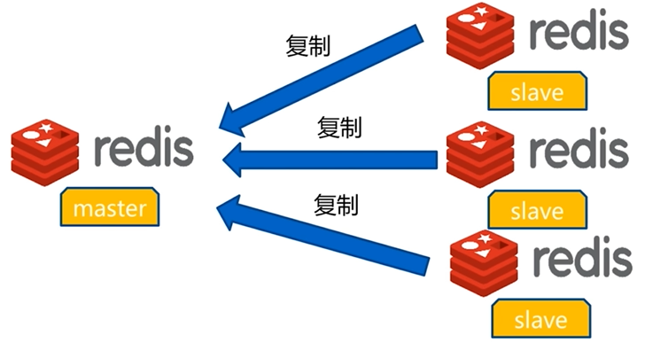
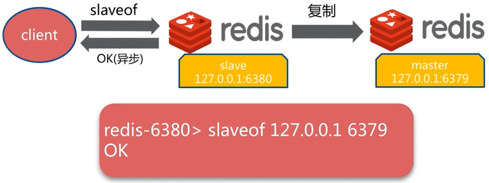
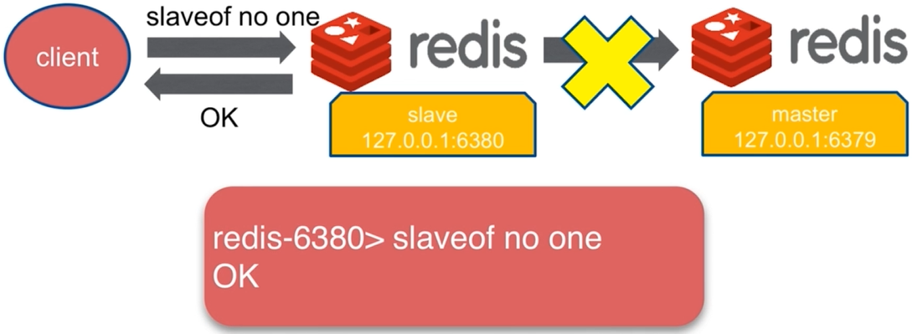
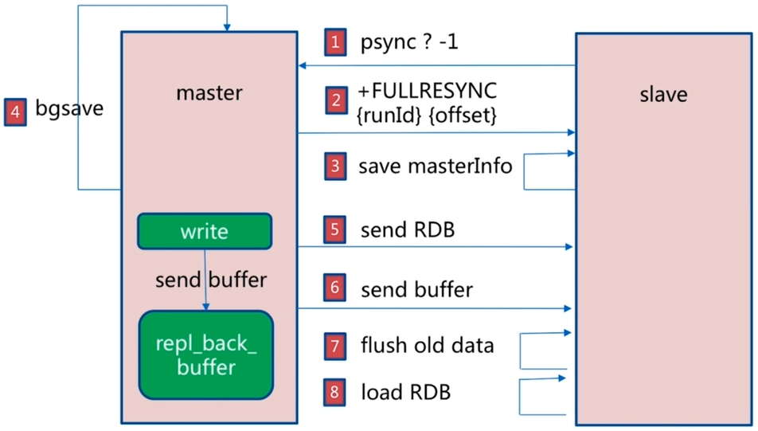
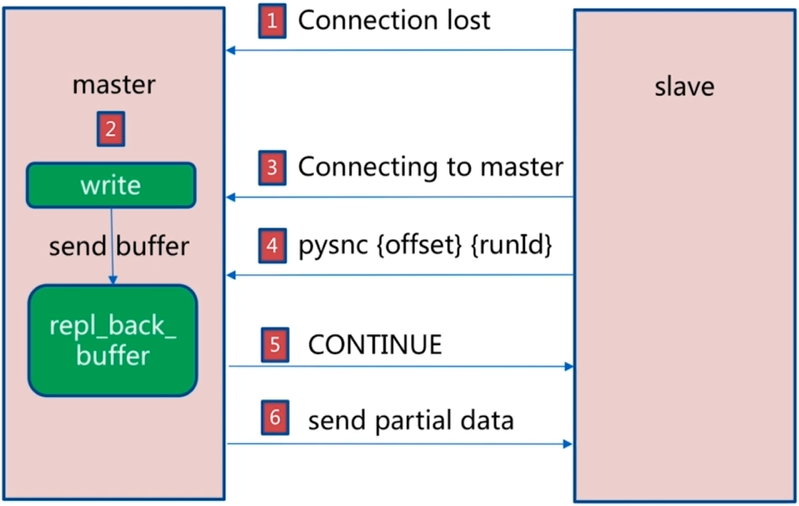
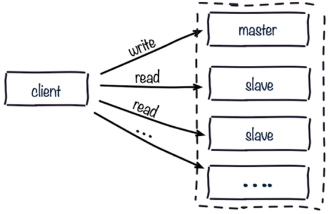
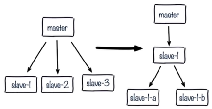

# Redis 复制

## 主从复制

单机问题：机器故障、容量瓶颈、`QPS` 瓶颈。

数据流向是单向的，`master` 到 `slave`。





**主从复制作用**

- 数据副本
- 扩展读性能

## 主从复制配置

### 命令实现





### 配置实现

```text
slaveof ip port
slave-read-only yes
```

## 全量复制



**开销**

1. bgsave时间
2. RDB文件网络传输时间
3. 从节点清空数据时间
4. 从节点加载RDB的时间
5. 可能的AOF重写时间

## 部分复制



## 主从复制常见问题

### 读写分离

- 读流量分摊到从节点



- 复制数据延迟
- 读到过期数据
- 从节点故障

### 配置不一致

1. maxmemory不一致：丢失数据
2. 数据结构优化参数(hash-max-ziplist-entries)：内存不一致

### 规避全量复制

**第一次全量复制**

- 第一次全量复制不可避免
- 小主节点、低峰

**节点运行ID不匹配**

- 主节点重启(运行ID变化)
- 故障转移，哨兵或集群

**复制积压缓冲区不足**

- 网络中断，部分复制无法满足
- 增大复制缓冲区配置rel_backlog_size

### 规避复制风暴

**单主节点复制风暴**

- 问题：主节点重启，多从节点复制
- 解决：更换复制拓扑



**单机器复制风暴**

- 问题：机器宕机后，大量全量复制
- 解决：主节点分散多机器

