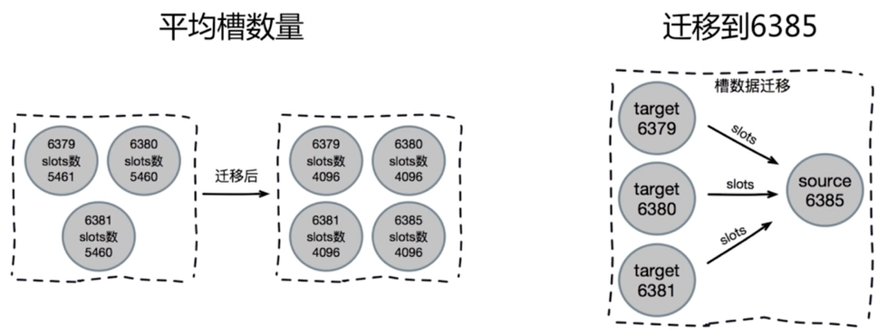

# 深入 Redis Cluster

## 集群伸缩原理

集群伸缩就是槽和数据在节点之间的移动。


## 扩容集群

### 准备新节点

- 集群模式
- 配置和其他节点统一
- 启动后是孤儿节点


### 加入集群

**作用**

- 为它迁移槽和数据实现扩容
- 作为从节点负责故障转移


### 迁移槽和数据

**槽迁移计划**



**迁移数据**


## 客户端路由

### moved重定向


### ask重定向


- moved表示槽已经确定迁移
- ask表示槽还在迁移中

### smart客户端

**原理**

1. 从集群中选一个可运行节点，使用cluster slots初始化槽和节点映射。
2. 将cluster slots的结果映射到本地，为每个节点创建JedisPool。
3. 准备执行命令。

**执行命令**


## JedisCluster

```java
Set<HostAndPort> nodeList = new HashSet<HostAndPort>();
nodeList.add(new HostAndPort(HOST1, PORT1));
nodeList.add(new HostAndPort(HOST2, PORT2));
nodeList.add(new HostAndPort(HOST3, PORT3));
nodeList.add(new HostAndPort(HOST4, PORT4));
nodeList.add(new HostAndPort(HOST5, PORT5));
nodeList.add(new HostAndPort(HOST6, PORT6));
JedisCluster jedisCluster = new JedisCluster(nodeList, timeout, poolConfig);
jedisCluster.set(key, value);
jedisCluster.get(key);
```

**使用技巧**

1. 单例：内置了所有节点的连接池
2. 无需手动借还连接池
3. 合理设置commons-pool