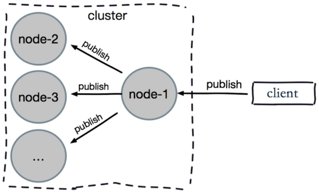

# 深入 Redis Cluster

## 集群伸缩原理

集群伸缩就是槽和数据在节点之间的移动。


## 扩容集群

### 准备新节点

- 集群模式
- 配置和其他节点统一
- 启动后是孤儿节点


### 加入集群

**作用**

- 为它迁移槽和数据实现扩容
- 作为从节点负责故障转移


### 迁移槽和数据

**槽迁移计划**


**迁移数据**


## 客户端路由

### moved重定向


### ask重定向


- moved表示槽已经确定迁移
- ask表示槽还在迁移中

### smart客户端

**原理**

1. 从集群中选一个可运行节点，使用cluster slots初始化槽和节点映射。
2. 将cluster slots的结果映射到本地，为每个节点创建JedisPool。
3. 准备执行命令。

**执行命令**


## JedisCluster

```java
Set<HostAndPort> nodeList = new HashSet<HostAndPort>();
nodeList.add(new HostAndPort(HOST1, PORT1));
nodeList.add(new HostAndPort(HOST2, PORT2));
nodeList.add(new HostAndPort(HOST3, PORT3));
nodeList.add(new HostAndPort(HOST4, PORT4));
nodeList.add(new HostAndPort(HOST5, PORT5));
nodeList.add(new HostAndPort(HOST6, PORT6));
JedisCluster jedisCluster = new JedisCluster(nodeList, timeout, poolConfig);
jedisCluster.set(key, value);
jedisCluster.get(key);
```

**使用技巧**

1. 单例：内置了所有节点的连接池
2. 无需手动借还连接池
3. 合理设置commons-pool

## 批量操作怎么实现

- mget、mset必须在一个槽

客户端对key进行分组，分别批量执行。


## 故障转移

### 故障发现

- 通过ping/pong消息实现故障发现：不需要sentinel

**主观下线**

某个节点认为另一个节点不可用。


**客观下线**

当半数以上持有槽的主节点都标记某节点主观下线。


**尝试客观下线**

- 通知集群内所有节点标记故障节点为客观下线
- 通知故障节点的从节点触发故障转移流程


### 故障恢复

**资格检查**

- 每个从节点检查与故障主节点的断线时间。
- 超过cluster-node-timeout * cluster-slave-validity-factor取消资格。
- cluster-slave-validity-factor默认是10。

**准备选举时间**


**选举投票**


**替换主节点**

1. 当前从节点取消复制成为主节点。
2. 执行clusterDelSlot撤销故障主节点分配的槽，并执行clusterAddSlot把这些槽分配给自己。
3. 向集群广播自己的pong消息，表明已经替换了故障从节点。

## 集群常见问题

### 集群完整性

- cluster-require-full-coverage默认为yes
- 集群中16384个槽全部可用：保证集群完整性
- 节点故障或者正在故障转移：(error)CLUSTERDOWN The cluster is down
- 大多数业务无法容忍，cluster-require-full-coverage建议设置为no

### 带宽消耗

- 官方建议集群内不要超过1000个节点
- 避免使用“大”集群：避免多业务使用一个集群，大业务可以多集群
- cluster-node-timeout：带宽和故障转移速度的均衡
- 尽量均匀分配到多机器上：保证高可用和带宽

### Pub/Sub广播

- 问题：publish在集群每个节点广播，加重带宽
- 解决：单独“走”一套Redis Sentinel



### 数据倾斜

- 节点和槽分配不均
- 不同槽对应键值数量差异较大
- 包含bigkey
- 内存相关配置不一致

### 请求倾斜

- 热点key：重要的key或者bigkey
- 避免bigkey
- 热键不要使用hash_tag
- 当一致性不高时，可以用本地缓存+MQ

### 读写分离

**集群模式的从节点不接受任何读写请求**

- 重定向到负责槽的主节点
- readonly命令可以读：连接级别命令

**读写分离**

- 存在问题：复制延迟、读取过期数据、从节点故障
- 修复客户端：cluster slaves {nodeId}

### 数据迁移

**redis-trib.rb import**

- 只能从单机迁移到集群
- 不支持在线迁移：source需要停写
- 不支持断点续传
- 单线程迁移：影响速度

**在线迁移**

- 唯美会：redis-migrate-tool
- 豌豆荚：redis-port

### 集群VS单机

**集群限制**

- key批量操作支持有限：例如mget、mset必须在一个slot
- key事务和lua支持有限：操作的key必须在一个节点
- key是数据分区的最小粒度：不支持bigkey分区
- 不支持多个数据库：集群模式下只有一个db 0
- 复制只支持一层：不支持树形复制结构

**分布式Redis不一定好**

- Redis Cluster：满足容量和性能的拓展性，很多业务不需要
- 大多数时客户端性能会降低
- 命令无法跨节点使用：mget、keys、scan、flush、sinter等
- Lua和事务无法跨节点使用
- 客户端维护更复杂：SDK和应用本身消耗
- 很多场景下Redis Sentinel已经足够好