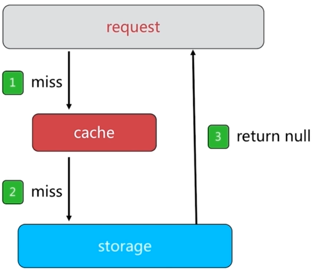
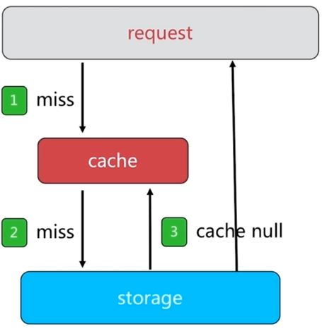
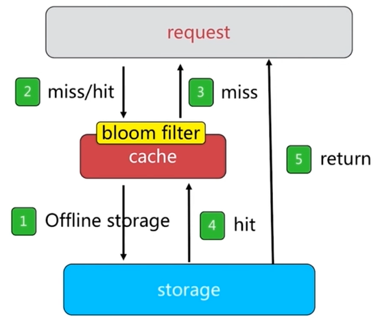

# 缓存设计与优化

## 缓存的受益与成本

**受益**

1. 加速读写
2. 降低后端负载

**成本**

1. 数据不一致：缓存层和数据层有时间窗口不一致，和更新策略有关
2. 代码维护成本：多了一层缓存逻辑
3. 运维成本：Redis Cluster

**使用场景**

1. 对于高消耗的SQL：join结果集/分组统计结果缓存
2. 利用Redis/Memcache优化IO响应时间
3. 大量写合并为批量写：如计数器先Redis累加再批量写DB

## 缓存更新策略

1. LRU/LFU/FIFO算法剔除：例如maxmemory-policy
2. 超时剔除：例如expire
3. 主动更新：开发控制生命周期

| 策略 | 一致性 | 维护成本 |
| --- | --- | --- |
| LRU/LIRS算法剔除 | 最差 | 低 |
| 超时剔除 | 较差 | 低 |
| 主动更新 | 强 | 高 |

1. 低一致性：最大内存和淘汰策略
2. 高一致性：超时剔除和主动更新结合，最大内存和淘汰策略兜底

## 缓存粒度控制

1. 通用性：全量属性更好
2. 占用空间：部分属性更好
3. 代码维护：表面上全量属性更好

## 缓存穿透问题

- 存储层没有相应数据，大量请求会穿透到存储层

**如何发现**

1. 业务的响应时间
2. 业务本身问题
3. 相关指标：总调用数、缓存层命中数、存储层命中数

**解决方法**

- 缓存空对象
- 需要更多的键
- 缓存层和存储层数据短期不一致

- 布隆过滤器拦截

