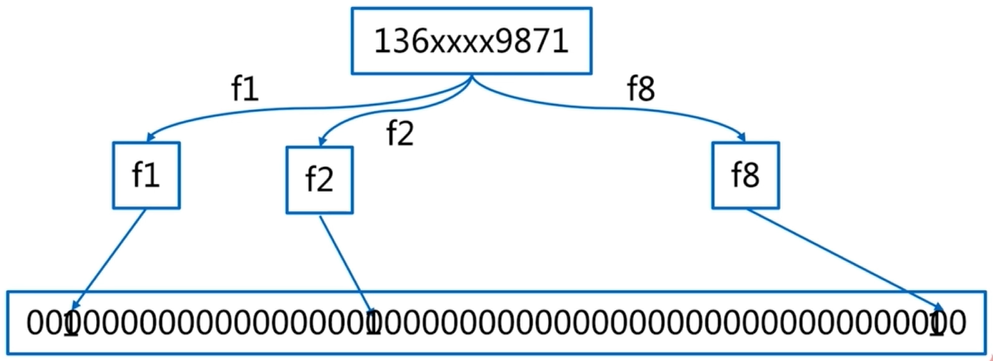
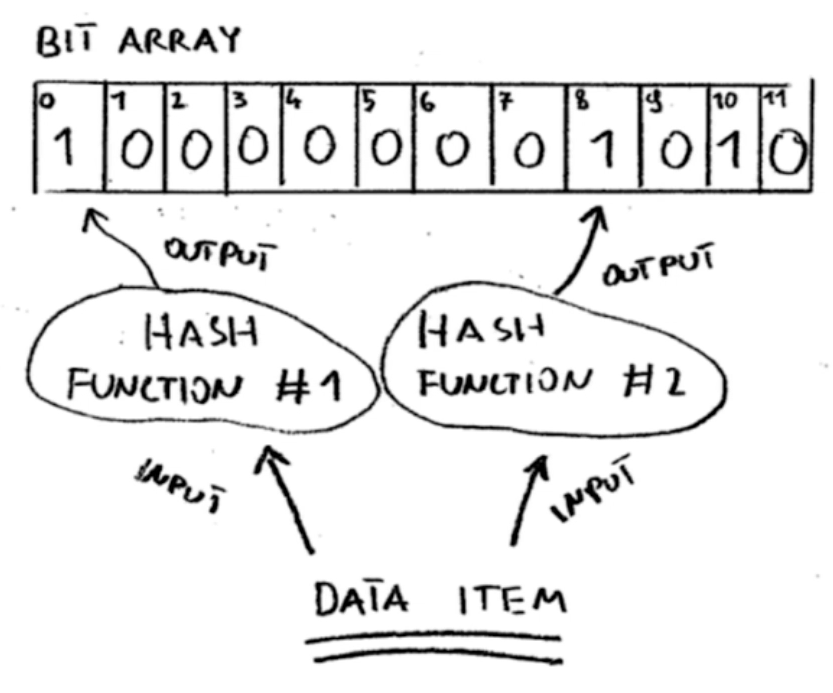

# Redis 布隆过滤器

## 问题

**现有50亿个电话号码，现有10万个电话号码，要快速准确判断这些电话号码是否已经存在？**

1. 通过数据库查询：实现**快速**有点难。
2. 数据预放在集合中：50亿*8字节≈40GB，内存**不足**。
3. hyperloglog：准确有点难。

**实际场景**

- 垃圾邮件过滤
- Word错误单词检测
- 网络爬虫重复url检测
- Hbase行过滤

## 布隆过滤器原理

- 1970年伯顿·布隆提出，用很小的空间，解决上述类似问题

**实现原理**

一个很长的二进制向量和若干个哈希函数

- 参数：m个二进制向量，n个预备数据，k个hash函数
- 构建布隆过滤器：n个预备数据走一遍上面过程
- 判断元素存在：走一遍上面过程，如果都是1，则表明存在，反之不存在

## 误差率

- 肯定存在误差：恰好都命中了
- 直观因素：m/n的比率，hash函数的个数

## 本地布隆过滤器

现有库：guava

**问题**

1. 容量受限制
2. 多个应用存在多个布隆过滤器，构建同步复杂

## Redis 布隆过滤器

使用位图实现布隆过滤器

- 速度慢：通过网络传输，比本地慢
- 容量受限：Redis 最大字符串为 512MB、Redis 单机容量

## Redis 分布式布隆过滤器

- 多个布隆过滤器：二次路由
- 基于pipeline提高效率