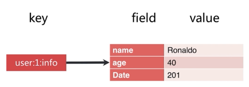
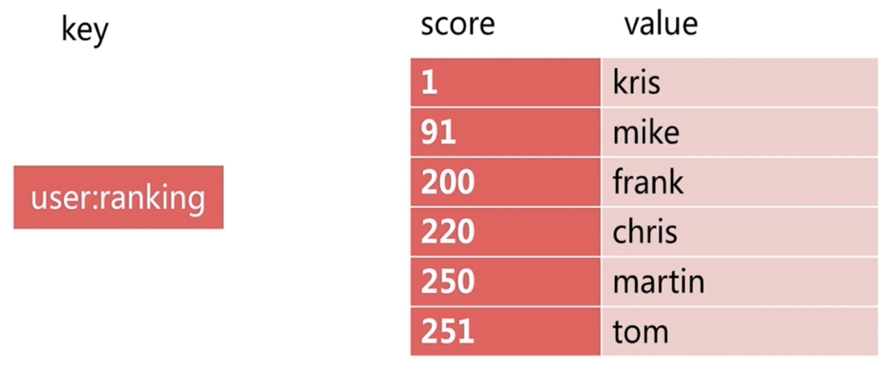

# API 的理解和使用

## 通用命令

### keys

- `keys [pattern]`，遍历所有`key`。
- `keys`命令一般不在生产环境使用。
- 热备从节点可以执行`keys`。
- 生产环境推荐使用`scan`。

```shell
127.0.0.1:6379> set hello world
OK
127.0.0.1:6379> set php good
OK
127.0.0.1:6379> set java best
OK
127.0.0.1:6379> keys *
1) "php"
2) "hello"
3) "java"
```

### dbsize

- `dbsize`，计算`key`的总数。
- `Redis`内部维护总数，可以在生产环境使用。

```shell
127.0.0.1:6379> keys *
1) "php"
2) "hello"
3) "java"
127.0.0.1:6379> dbsize
(integer) 3
```

### exists

- `exists key`，检查`key`是否存在。

```shell
127.0.0.1:6379> set hello world
OK
127.0.0.1:6379> exists hello
(integer) 1
127.0.0.1:6379> del hello
(integer) 1
127.0.0.1:6379> exists hello
(integer) 0
```

### del

- `del key`，删除指定`key-value`。

```shell
127.0.0.1:6379> set hello world
OK
127.0.0.1:6379> get hello
"world"
127.0.0.1:6379> del hello
(integer) 1
127.0.0.1:6379> get hello
(nil)
```

### expire/ttl/persist

- `expire key seconds`，`key`在`seconds`秒后过期。
- `ttl key`，查看`key`剩余的过期时间。
- `persist key`，去掉`key`的过期时间。

```shell
127.0.0.1:6379> set hello world
OK
127.0.0.1:6379> expire hello 20
(integer) 1
127.0.0.1:6379> ttl hello
(integer) 16
127.0.0.1:6379> get hello
"world"
127.0.0.1:6379> ttl hello
(integer) -2 (-2表示key不存在)
127.0.0.1:6379> get hello
(nil)

127.0.0.1:6379> set hello world
OK
127.0.0.1:6379> expire hello 20
(integer) 1
127.0.0.1:6379> ttl hello
(integer) 18
127.0.0.1:6379> persist hello
(integer) 1
127.0.0.1:6379> ttl hello
(integer) -1 (-1表示key存在，并且没有过期时间)
127.0.0.1:6379> get hello
"world"
```

### type

- `type key`，返回`key`的类型。
- 结果有`string`、`hash`、`list`、`set`、`zset`、`none`六种。

```shell
127.0.0.1:6379> set a b
OK
127.0.0.1:6379> type a
string
127.0.0.1:6379> sadd myset 1 2 3
(integer) 3
127.0.0.1:6379> type myset
set
```

### 时间复杂度

| 命令 | 时间复杂度 |
| --- | --- |
| keys | O(n) |
| dbsize | O(1) |
| del | O(1) |
| exists | O(1) |
| expire/ttl/persist | O(1) |
| type | O(1) |

## 单线程

### 单线程为什么这么快？

- 纯内存
- 非阻塞`IO`
- 避免线程切换和竞态消耗

### 单线程需要注意什么？

- 一次只运行一条命令
- 拒绝长/慢命令

## 字符串

| 命令 | 描述 | 时间复杂度 |
| --- | --- | --- |
| get key | 获取key对应的value | O(1) |
| set key value | 设置key-value | O(1) |
| del key | 删除key-value | O(1) |

```shell
127.0.0.1:6379> set hello "world"
OK
127.0.0.1:6379> get hello
"world"
127.0.0.1:6379> del hello
(integer) 1
127.0.0.1:6379> get hello
(nil)
```

| 命令 | 描述 | 时间复杂度 |
| --- | --- | --- |
| incr key | key自增1，如果key不存在，自增后get(key)=1 | O(1) |
| decr key | key自减1，如果key不存在，自减后get(key)=-1 | O(1) |
| incrby key k | key自增k，如果key不存在，自增后get(key)=k | O(1) |
| decrby key k | key自减k，如果key不存在，自减后get(key)=-k | O(1) |

```shell
127.0.0.1:6379> get counter
(nil)
127.0.0.1:6379> incr counter
(integer) 1
127.0.0.1:6379> get counter
"1"
127.0.0.1:6379> incrby counter 99
(integer) 100
127.0.0.1:6379> decr counter
(integer) 99
127.0.0.1:6379> get counter
"99"
```

**记录网站每个用户个人主页的访问量？**

```shell
# 单线程 无竞争
incr userid:pageview
```

**缓存视频的基本信息（数据源在MySQL中）伪代码？**

```java
public VideoInfo get(long id) {
    String redisKey = redisPrefix + id;
    VideoInfo videoInfo = redis.get(redisKey);
    if (videoInfo == null) {
        videoInfo = mysql.get(id);
        if (videoInfo != null) {
            redis.set(redisKey, serialize(videoInfo));
        }
    }
    return videoInfo;
}
```

**实现分布式id生成器？**

```shell
# 原子操作
incr id
```

| 命令 | 描述 | 时间复杂度 |
| --- | --- | --- |
| set key value | 不管key是否存在，都设置 | O(1) |
| setnx key value | key不存在，才设置 | O(1) |
| set key value xx | key存在，才设置 | O(1) |

```shell
127.0.0.1:6379> exists php
(integer) 0
127.0.0.1:6379> set php good
OK
127.0.0.1:6379> setnx php bad
(integer) 0
127.0.0.1:6379> set php best xx
OK
127.0.0.1:6379> get php
"best"
127.0.0.1:6379> exists java
(integer) 0
127.0.0.1:6379> setnx java best
(integer) 1
127.0.0.1:6379> set java easy xx
OK
127.0.0.1:6379> get java
"easy"
127.0.0.1:6379> exists lua
(integer) 0
127.0.0.1:6379> set lua hh xx
(nil)
```

| 命令 | 描述 | 时间复杂度 |
| --- | --- | --- |
| mget key1 key2 ... | 批量获取key，原子操作 | O(n) |
| mset key1 value1 key2 value2 ... | 批量设置key-value | O(n) |

```shell
127.0.0.1:6379> mset hello world java best php good
OK
127.0.0.1:6379> mget hello java php
1) "world"
2) "best"
3) "good"
```

`mget/mset`命令减少了客户端和服务器之间的网络开销。

| 命令 | 描述 | 时间复杂度 |
| --- | --- | --- |
| getset key newValue | set key newValue并返回旧的value | O(1) |
| append key value | 将value追加到旧的value | O(1) |
| strlen key | 返回字符串的长度(注意中文) | O(1) |

```shell
127.0.0.1:6379> set hello world
OK
127.0.0.1:6379> getset hello php
"world"
127.0.0.1:6379> append hello ",java"
(integer) 8
127.0.0.1:6379> get hello
"php,java"
127.0.0.1:6379> strlen hello
(integer) 8
127.0.0.1:6379> set hello "足球￲"
OK
127.0.0.1:6379> strlen hello
(integer) 4
```

| 命令 | 描述 | 时间复杂度 |
| --- | --- | --- |
| incrbyfloat key 3.5 | 增加key对应的值3.5 | O(1) |
| getrange key start end | 获取字符串指定下标所有的值 | O(1) |
| setrange key index value | 设置指定下标所有对应的值 | O(1) |

```shell
127.0.0.1:6379> incr counter
(integer) 1
127.0.0.1:6379> incrbyfloat counter 1.1
"2.10000000000000009"
127.0.0.1:6379> get counter
"2.10000000000000009"
127.0.0.1:6379> set hello javabest
OK
127.0.0.1:6379> getrange hello 0 2
"jav"
127.0.0.1:6379> setrange hello 4 p
(integer) 8
127.0.0.1:6379> get hello
"javapest"
```

## hash



| 命令 | 描述 | 时间复杂度 |
| --- | --- | --- |
| hget key field | 获取hash key对应的field的value | O(1) |
| hset key field value | 设置hash key对应的field的value | O(1) |
| hdel key field | 删除hash key对应的field的value | O(1) |

```shell
127.0.0.1:6379> hset user:1:info age 23
(integer) 1
127.0.0.1:6379> hget user:1:info age
"23"
127.0.0.1:6379> hset user:1:info name ronaldo
(integer) 1
127.0.0.1:6379> hgetall user:1:info
1) "age"
2) "23"
3) "name"
4) "ronaldo"
127.0.0.1:6379> hdel user:1:info age
(integer) 1
127.0.0.1:6379> hgetall user:1:info
1) "name"
2) "ronaldo"
```

| 命令 | 描述 | 时间复杂度 |
| --- | --- | --- |
| hexists key field | 判断hash key是否有field | O(1) |
| hlen key | 获取hash key field的数量 | O(1) |

```shell
127.0.0.1:6379> hgetall user:1:info
1) "name"
2) "ronaldo"
3) "age"
4) "23"
127.0.0.1:6379> hexists user:1:info name
(integer) 1
127.0.0.1:6379> hlen user:1:info
(integer) 2
```

| 命令 | 描述 | 时间复杂度 |
| --- | --- | --- |
| hmget key field1 field2 ... | 批量获取hash key的一批field对应的值 | O(n) |
| hmset key field1 value1 field2 value2 ... | 批量设置hash key的一批field value | O(n) |

```shell
127.0.0.1:6379> hmset user:2:info age 30 name kaka page 50
OK
127.0.0.1:6379> hlen user:2:info
(integer) 3
127.0.0.1:6379> hmget user:2:info age name
1) "30"
2) "kaka"
```

| 命令 | 描述 | 时间复杂度 |
| --- | --- | --- |
| hgetall key | 返回hash key对应所有的field和value | O(n) |
| hvals key | 返回hash key对应所有field的value | O(n) |
| hkeys key | 返回hash key对应所有field | O(n) |

## 列表

- 有序
- 可以重复
- 左右两边插入弹出

| 命令 | 描述 | 时间复杂度 |
| --- | --- | --- |
| rpush key value1 ... valueN | 从列表右侧插入值 | O(n) |
| lpush key value1 ... valueN | 从列表左侧插入值 | O(n) |
| linsert key before/after value newValue | 在list指定的值前/后插入newValue | O(n) |
| lpop key | 从列表左侧弹出一个item | O(1) |
| rpop key | 从列表右侧弹出一个item | O(1) |

**lrem**

- lrem key count value
- 根据count值 从列表中删除所有value相等的项
- 复杂度：O(n)
- count > 0 从左到右 删除最多count个value相等的项
- count < 0 从右到左 删除最多Math.abs(count)个value相等的项
- count = 0 删除所有value相等的项

| 命令 | 描述 | 时间复杂度 |
| --- | --- | --- |
| ltrim key start end | 按照索引范围修剪列表 | O(n) |
| lrange key start end | 索取列表指定索引范围所有item | O(n) |
| lindex key index | 获取列表指定索引的item | O(n) |
| llen key | 获取列表长度 | O(1) |
| lset key index newValue | 设置列表指定索引值为newValue | O(n) |

**微博-TimeLine**

关注的人更新微博，`lpush`添加到列表最左侧。

| 命令 | 描述 | 时间复杂度 |
| --- | --- | --- |
| blpop key timeout | lpop阻塞版本 timeout是阻塞超时时间 timeout=0为永远不阻塞 | O(1) |
| brpop key timeout | rpop阻塞版本 timeout是阻塞超时时间 timeout=0为永远不阻塞 | O(1) |

## 集合

- 无序
- 无重复
- 支持集合间操作

| 命令 | 描述 | 时间复杂度 |
| --- | --- | --- |
| sadd key element | 向集合key添加element 如果element已经存在 添加失败 | O(1) |
| srem key element | 将集合key中的element移除掉 | O(1) |

```shell
# 计算集合大小
scard user:1:follow = 4
# 判断 it 是否在集合中
sismember user:1:follow it = 1(存在)
# 从集合中随机挑count个元素
srandmember user:1:follow count = his
# 从集合中随机弹出一个元素
spop user:1:follow = sports
# 获取集合所有元素
smembers user:1:follow = music his sports it
```

**srandmember 和 spop**

- spop 从集合中弹出。
- srandmember 不会破坏集合。

**微博-抽奖系统**

使用`spop`进行抽奖。

```shell
# 差集
sdiff user:1:follow user:2:follow = music his
# 交集
sinter user:1:follow user:2:follow = it sports
# 并集
sunion user:1:follow user:2:follow = it music his sports news ent
# 将差集/交集/并集结果保存在destkey中
sdiff/sinter/sunion store destkey
```

## 有序集合

根据分数进行排序。



| 命令 | 描述 | 时间复杂度 |
| --- | --- | --- |
| zadd key score element | 添加score和element | O(logN) |
| zrem key element | 删除元素 | O(1) |
| zscore key element | 返回元素的分数 | O(1) |
| zincrby key increScore element | 增加或减少元素的分数 | O(1) |
| zcard key | 返回元素的总个数 | O(1) |
| zrange key start end | 返回指定索引范围内的升序元素 | O(log(n) + m) |
| zrangebyscore key minScore maxScore | 返回指定分数范围内的升序元素 | O(log(n) + m) |
| zcount key minScore maxScore | 返回有序集合内在指定分数范围内的个数 | O(log(n) + m) |
| zremrangebyrank key start end | 删除指定排名内的升序元素 | O(log(n) + m) |
| zremrangebyscore key minScore maxScore | 删除指定分数内的升序元素 | O(log(n) + m) |