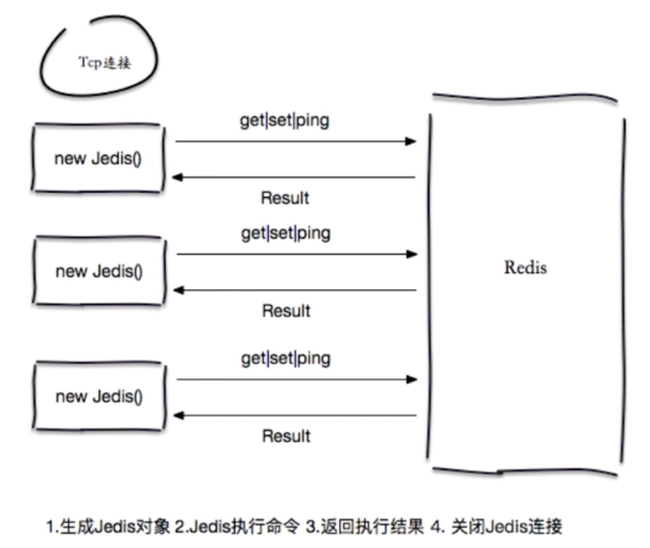
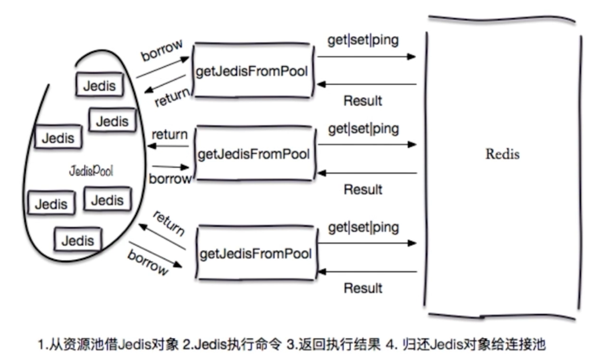

# Redis 客户端的使用

## Jedis





| \ | 优点 | 缺点 |
| --- | --- | --- |
| 直连 | 简单方便<br/>适用于少量长期连接的场景 | 存在每次新建/关闭TCP开销<br/>资源无法控制 存在连接泄露的可能<br/>Jedis对象线程不安全 |
| 连接池 | Jedis预先生成 降低开销使用<br/>连接池的形式保护和控制资源的使用 | 相对于直连 使用相对麻烦 尤其在资源的管理上需要很多参数来保证 一旦规划不合理也会出现问题 |

```java
// 初始化Jedis连接池 通常来讲JedisPool是单例的
GenericObjectPoolConfig poolConfig = new GenericObjectPoolConfig();
JedisPool jedisPool = new JedisPool(poolConfig, "127.0.0.1", 6379);
```

```java
Jedis jedis = null;
try {
    // 1. 从连接池获取jedis对象
    jedis = jedisPool.getResource();
    // 2. 执行操作
    jedis.set("hello", "world");
} catch (Exception e) {
    // Exception Handler
} finally {
    if (jedis != null) {
        // 如果使用JedisPool close操作不是关闭连接 代表归还连接池
        jedis.close();
    }
}
```

## Jedis 配置优化