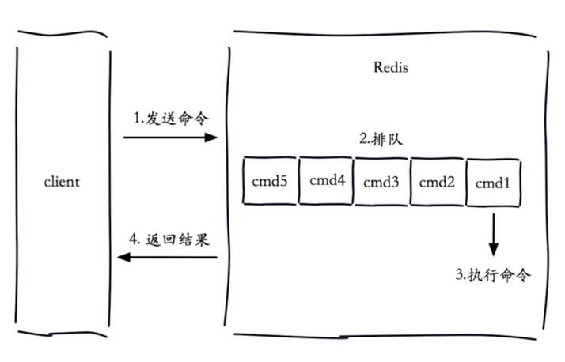
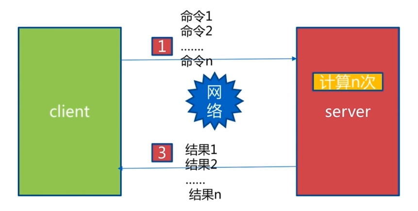
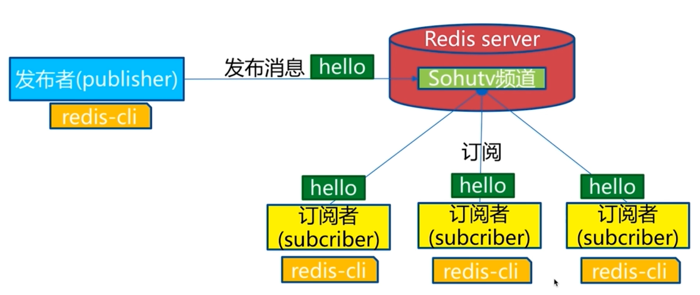
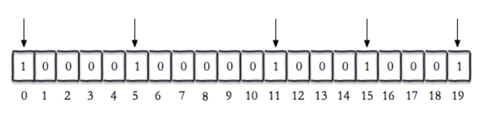

# 瑞士军刀 Redis 其他功能

## 慢查询



- 慢查询发生在第3阶段
- 客户端超时不一定慢查询，但慢查询是客户端超时的一个可能因素

**slowlog-max-len**

1. 先进先出队列
2. 固定长度
3. 保存在内存内

**slowlog-log-slower-than**

1. 慢查询阀值(单位 微秒)
2. slowlog-log-slower-than = 0 记录所有命令
3. slowlog-log-slower-than < 0 不记录任何命令

**默认值**

```text
config get slowlog-max-len = 128
config get slowlog-log-slower-than = 10000
```

**动态配置**

```text
config set slowlog-max-len = 1000
```

**慢查询命令**

```shell
# 获取慢查询队列
slowlog get [n]
# 获取慢查询队列长度
slowlog len
# 清空慢查询队列
slowlog reset
```

**运维经验**

1. slowlog-log-slower-than不要设置过大，默认10ms，通常设置1ms。
2. slowlog-max-len不要设置过小，通常设置1000左右。
3. 理解命令生命周期。
4. 定期持久化慢查询。

## pipeline



1次pipeline(n条命令) = 1次网络时间 + n次命令时间

1. Redis的命令时间是微秒级别。
2. pipeline每次条数要控制(网络)。

```java
Jedis jedis = new Jedis("127.0.0.1", 6379);
Pipeline pipeline = jedis.pipelined();
for (int i = 0; i < 100; i ++) {
    pipeline.hset("hashkey:" + i, "field" + i, "value" + i);
}
pipeline.syncAndReturnAll();
```

M操作是原子的，pipeline是非原子的。

**使用建议**

1. 注意每次pipeline携带数据量。
2. pipeline每次只能作用在一个Redis节点上。
3. M操作和pipeline的区别。

## 发布订阅

**角色**

- 发布者(publisher)
- 订阅者(subscriber)
- 频道(channel)



## BitMap

**setbit**

- setbit key offset value
- 给位图指定索引设置值

```shell
127.0.0.1:6379> setbit unique:users:2020-12-02 0 1
(integer) 0
127.0.0.1:6379> setbit unique:users:2020-12-02 5 1
(integer) 0
127.0.0.1:6379> setbit unique:users:2020-12-02 11 1
(integer) 0
127.0.0.1:6379> setbit unique:users:2020-12-02 15 1
(integer) 0
127.0.0.1:6379> setbit unique:users:2020-12-02 19 1
(integer) 0
```



**getbit**

- getbit key offset
- 获取位图指定索引的值

```shell
127.0.0.1:6379> getbit unique:users:2020-12-02 8
(integer) 0
127.0.0.1:6379> getbit unique:users:2020-12-02 19
(integer) 1
```

**bitcount**

- bitcount key [start end]
- 获取位图指定范围[start ~ end]位值为1的个数

```shell
127.0.0.1:6379> bitcount unique:users:2020-12-02
(integer) 5
127.0.0.1:6379> bitcount unique:users:2020-12-02 1 3
(integer) 3
```

**bitop**

- bitop op destkey key [key ...]
- 做多个BitMap的and(交集)、or(并集)、not(非)、xor(异或)操作并将结果保存在destkey中

```shell
# 求两个位图的并集
bitop and unique-result unique-1 unique-2
```

**bitpos**

- bitpos key targetBit [start end]
- 计算位图指定范围[start ~ end]第一个偏移量对应的值等于targetBit的位置

### 独立用户统计

- 使用set和bitmap
- 1亿用户 每天5千万独立访问

| 数据类型 | 每个userId占用空间 | 需要存储的用户量 | 全部内存量 |
| --- | --- | --- | --- |
| set | 32位 | 50,000,000 | 32 * 50,000,000 = 200MB |
| bitmap | 1位 | 100,000,000 | 1 * 100,000,000 = 12.5MB |

**使用经验**

1. type = string，最大512MB。
2. 注意setbit时的偏移量，可能有较大耗时。
3. 位图不是绝对好。

## HyperLogLog

1. 基于HyperLogLog算法：使用极小空间完成独立数量统计。
2. 本质还是字符串。

**pfadd**

- pfadd key element [element ...]
- 向hyperloglog添加元素

**pfcount**

- pfcount key [key ...]
- 计算hyperloglog的独立个数

**pfmerge**

- pfmerge destkey sourcekey [sourcekey ...]
- 合并多个hyperloglog

```shell
127.0.0.1:6379> pfadd 2020_12_02:unique:ids uuid-1 uuid-2 uuid-3 uuid-4
(integer) 1
127.0.0.1:6379> pfcount 2020_12_02:unique:ids
(integer) 4
127.0.0.1:6379> pfadd 2020_12_02:unique:ids uuid-1 uuid-2 uuid-3 uuid-90
(integer) 1
127.0.0.1:6379> pfcount 2020_12_02:unique:ids
(integer) 5
```

```shell
127.0.0.1:6379> pfadd 2020_11_11:unique:ids uuid-1 uuid-2 uuid-3 uuid-4
(integer) 1
127.0.0.1:6379> pfcount 2020_11_11:unique:ids
(integer) 4
127.0.0.1:6379> pfadd 2020_11_12:unique:ids uuid-5 uuid-6 uuid-7 uuid-8
(integer) 1
127.0.0.1:6379> pfcount 2020_11_12:unique:ids
(integer) 4
127.0.0.1:6379> pfmerge 2020_11:unique:ids 2020_11_11:unique:ids 2020_11_12:unique:ids
OK
127.0.0.1:6379> pfcount 2020_11:unique:ids
(integer) 8
```

**使用经验**

1. 是否能容忍错误？(错误率：0.81%)
2. 是否需要单条数据？