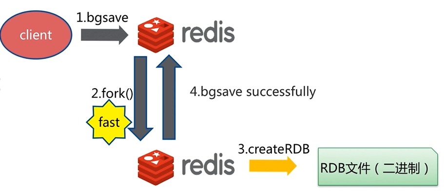

# Redis 持久化的取舍和选择

## 持久化的作用

**什么是持久化**

Redis所有数据保持在内存中，对数据的更新将异步地保存到磁盘上。

**持久化方式**

快照：MySQL Dump、Redis RDB

写日志：MySQL Binlog、Hbase HLog、Redis AOF

## RDB

**什么是RDB**

**触发机制**

- save命令
- 文件策略：如存在老的RDB文件，新文件进行替换
- 复杂度：O(n)

- bgsave命令
- 文件策略和复杂度与save相同

| 命令 | save | bgsave |
| --- | --- | --- |
| IO类型 | 同步 | 异步 |
| 阻塞 | 是 | 是(阻塞发生在fork) |
| 复杂度 | O(n) | O(n) |
| 优点 | 不会消耗额外内存 | 不阻塞客户端命令 |
| 缺点 | 阻塞客户端命令 | 需要fork，消耗内存 |