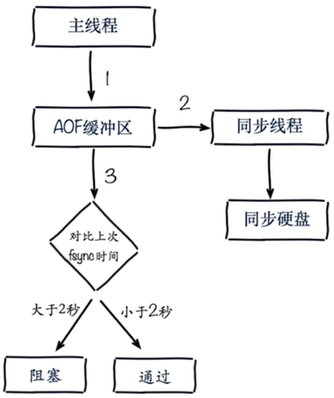

# 常见的持久化开发运维问题

## fork

1. 同步操作
2. Redis内存越大，耗时越长
3. info:latest_fork_usec查看fork执行时间

**改善fork**

1. 优先使用物理机或者高效支持fork操作的虚拟化技术
2. 控制Redis实例最大可用内存：maxmemory
3. 合理配置Linux内存分配策略：vm.overcommit_memory = 1
4. 降低fork频率：例如放宽AOF重写自动触发时机，不必要的全量复制

## 子进程开销与优化

**CPU**

- 开销：RDB和AOF文件生成，属于CPU密集型
- 优化：不做CPU绑定，不和CPU密集型部署

**内存**

- 开销：fork内存开销，copy-on-write
- 优化：echo never > /sys/kernel/mm/transparent_hugepage/enabled

**硬盘**

- 开销：AOF和RDB文件写入，可以结合iostat，iotop分析

### 硬盘优化

1. 不要和高硬盘负载服务部署在一起：存储服务、消息队列等
2. no-appendfsync-on-rewrite = yes
3. 根据写入量决定磁盘类型：SSD
4. 单机多实例持久化文件目录可以考虑分盘

## AOF追加阻塞

为了避免数据丢失，当主线程检测到上次同步时间距离当前时间超过2秒时，主线程会阻塞，直到同步完成。