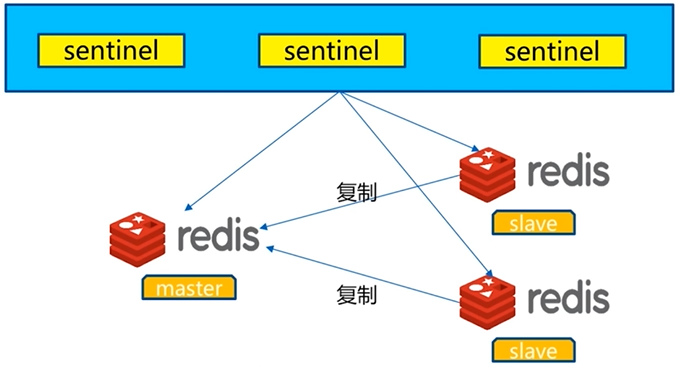
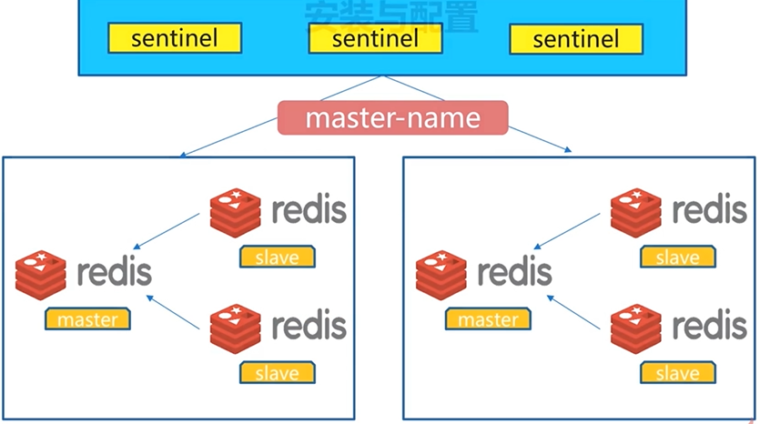
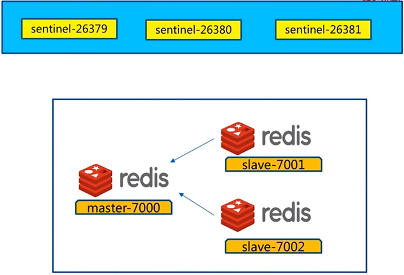
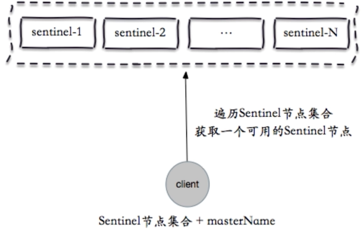
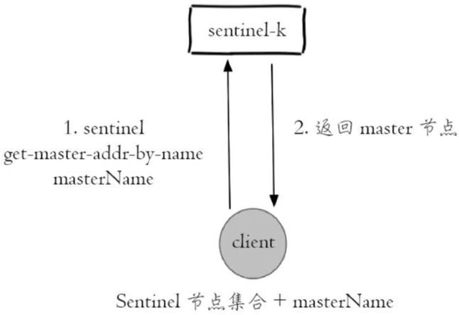
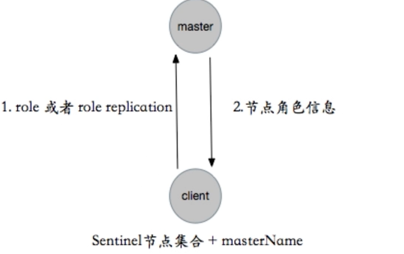
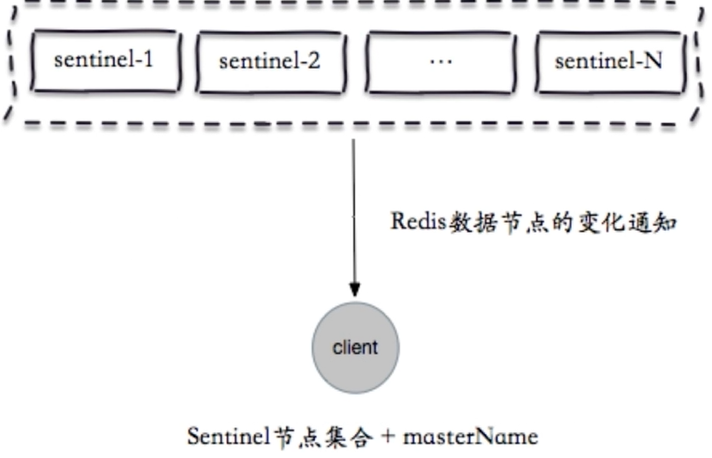
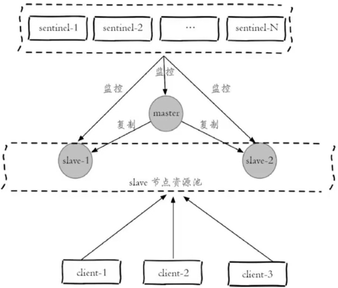

# Redis Sentinel

## 主从复制问题

- 手动故障转移
- 写能力和存储能力受限

## Redis Sentinel架构

- 客户端从Sentinel获取Redis信息

**故障转移**

1. 多个Sentinel发现并确认master有问题。
2. 选举出一个Sentinel作为领导。
3. 选出一个slave作为master。
4. 同时其余slave成为新的master的slave。
5. 同时客户端主从变化。
6. 等待老的master复活成为新master的slave。

- Redis Sentinel可以监控多套master和slave
- 使用master-name进行区分

## 基本原理

## Redis Sentinel内部原理

**每10秒每个Sentinel对master和slave执行info**

- 发现slave节点
- 确认主从关系

**每2秒每个Sentinel通过master节点的channel交换信息**

- 通过__sentinel__:hello频道交互
- 交互对节点的“看法”和自身信息

**每1秒每个Sentinel对其他Sentinel和Redis执行ping**

- 心跳检测，失败判定依据

## 主观下线和客观下线

- 主观下线：每个Sentinel节点对Redis节点失败的“偏见”
- 客观下线：所有Sentinel节点对Redis节点失败“达成共识”(超过quorum个同意)

## 领导者选举

1. 每个做主观下线的Sentinel节点向其他Sentinel节点发送命令，要求将它设置为领导者。
2. 收到命令的Sentinel节点如果没有同意通过其他Sentinel节点发送的命令，那么将同意该请求，否则拒绝。
3. 如果该Sentinel节点发现自己的票数已经超过Sentinel结合半数且超过quorum，那么它将成为领导者。
4. 如果此过程有多个Sentinel节点成为了领导者，那么将等待一段时间重新进行选举。

## 故障转移

1. 从slave节点中选出一个“合适的”节点作为新的master节点。
2. 对上面的slave节点执行slaveof no one命令让其成为master节点。
3. 向剩余的slave节点发送命令，让它们成为新master节点的slave节点，复制规则和parallel-syncs参数有关。
4. 更新对原来master节点配置为slave，并保持着对其“关注”，当其恢复后命令它去复制新的master节点。

**选择“合适”的slave节点**

1. 选择slave-priority(slave节点优先级)最高的slave节点，如果存在则返回，不存在则继续。
2. 选择复制偏移量最大的slave节点(复制的最完整)，如果存在则返回，不存在则继续。
3. 选择runId最小的slave节点。

## 高可用读写分离

