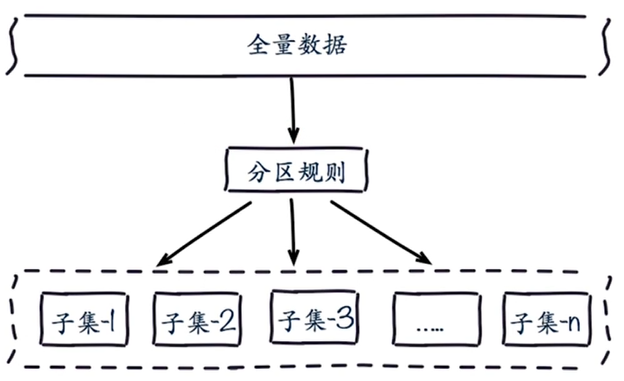
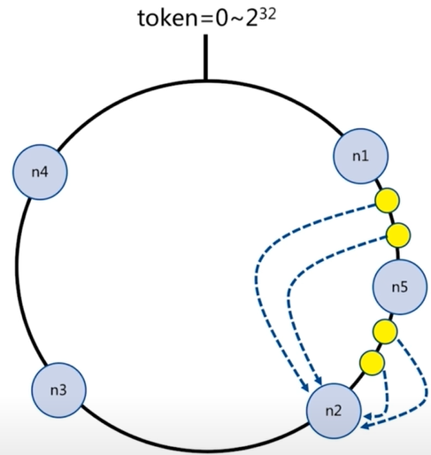
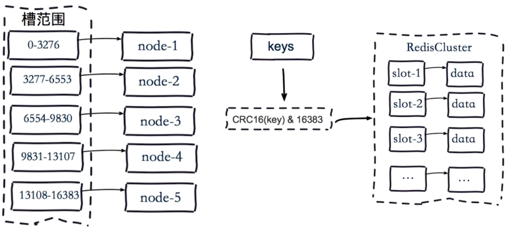

# 初识 Redis Cluster

## 呼唤集群

### 为什么呼唤

**并发量**

Redis并发10万每秒。

业务需要100万每秒呢？

**数据量**

Redis单台机器内存16到256G。

业务需要500G呢？

## 数据分布概论

| 分布方式 | 特点 | 典型产品 |
| --- | --- | --- |
| 哈希分布 | 数据分散度高 键值分布业务无关 无法顺序访问 支持批量操作 | 一致性哈希MemCache Redis Cluster 其他缓存产品 |
| 顺序分布 | 数据分散度易倾斜 键值业务相关 可顺序访问 支持批量操作 | BigTable HBase |

## 节点取余分区

**hash(key) % nodes**

- 客户端分片：哈希+取余
- 节点伸缩：数据节点关系变化，导致数据迁移
- 迁移数量和添加节点数据有关：建议翻倍扩容

## 一致性哈希分区

- 客户端分片：哈希+顺时针(优化取余)
- 节点伸缩：只影响临近节点，但是还是有数据迁移
- 翻倍伸缩：保证最小迁移数据和负载均衡

## 虚拟槽哈希分区

- 预设虚拟槽：每个槽映射一个数据子集，一般比节点数大
- 良好的哈希函数：例如CRC16
- 服务端管理节点、槽、数据：例如Redis Cluster