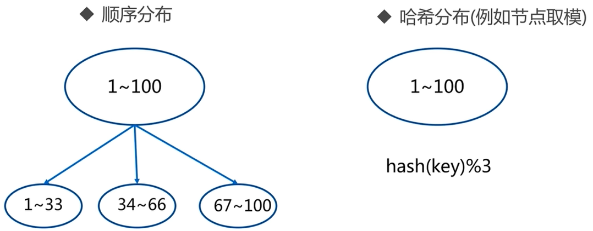

# 初识 Redis Cluster

## 呼唤集群

### 为什么呼唤

**并发量**

Redis并发10万每秒。

业务需要100万每秒呢？

**数据量**

Redis单台机器内存16到256G。

业务需要500G呢？

## 数据分布概论

| 分布方式 | 特点 | 典型产品 |
| --- | --- | --- |
| 哈希分布 | 数据分散度高 键值分布业务无关 无法顺序访问 支持批量操作 | 一致性哈希MemCache Redis Cluster 其他缓存产品 |
| 顺序分布 | 数据分散度易倾斜 键值业务相关 可顺序访问 支持批量操作 | BigTable HBase |

## 节点取余分区